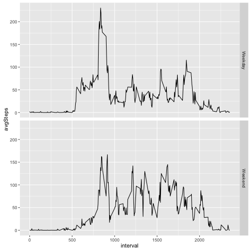

# Reproducible Research: Peer Assessment 1

## Loading and preprocessing the data

```r
unzip(zipfile="activity.zip")
rawdata <- read.csv("activity.csv",stringsAsFactors = FALSE)
rawdata$date <- as.Date(rawdata$date)
```


```r
library(dplyr)
library(ggplot2)
```

## What is mean total number of steps taken per day?

```r
byDate <- group_by(rawdata,date)
byDate <- summarize(byDate,sum(steps,na.rm = TRUE))
colnames(byDate) <- c("date","nsteps")
hist(byDate$nsteps,xlab="# of Steps",main="Distribution of Total Daily # of Steps",ylim=c(0,30))
```


```r
MeanDailySteps <- mean(byDate$nsteps,na.rm=TRUE)
MedianDailySteps <- median(byDate$nsteps,na.rm=TRUE)
MeanDailySteps
```

```
## [1] 9354.23
```

```r
MedianDailySteps
```

```
## [1] 10395
```

## What is the average daily activity pattern?

```r
byInterval <- group_by(rawdata,interval)
byInterval <- summarize(byInterval,mean(steps,na.rm=TRUE))
colnames(byInterval) <- c("int","nsteps")
#create new columns to enable better x-axis (HH:MM rather than 500, 2000 etc)
byInterval$intNum <- seq(1,nrow(byInterval),1)
start <- as.POSIXct(x = "00:00", format = "%H:%M")
times <- seq(from = start, by = "5 mins", length.out = 288) 
byInterval$times <- as.character(format(times,"%H:%M"))
plot(byInterval$intNum,byInterval$nsteps,type="l",axes=FALSE,xlab="time",ylab="average #steps")
labels <- byInterval[byInterval[,"intNum"]%%12==1,"times"]
axis(1, at = seq(1,288,12), labels = labels$times)
axis(2)
```


On average across all the days in the dataset, the 5-minute interval contains
the maximum number of steps?

```r
head(byInterval[order(byInterval$nsteps,decreasing = TRUE),],2)
```

```
## Source: local data frame [2 x 4]
## 
##     int   nsteps intNum times
##   (int)    (dbl)  (dbl) (chr)
## 1   835 206.1698    104 08:35
## 2   840 195.9245    105 08:40
```

## Imputing missing values

Count missing values

```r
sum(is.na(rawdata[,"steps"]))
```

```
## [1] 2304
```

The strategy is to replace a missing value with the average for its interval


```r
z <- merge(rawdata,byInterval,by.x="interval",by.y="int")
z$steps[is.na(z$steps)] <- z$nsteps[is.na(z$steps)]
adjdata <- z[,1:3]
```
Make a histogram of the total number of steps taken each day and calculate the mean and median total number of steps.


```r
byDateAdj <- group_by(adjdata,date)
byDateAdj <- summarize(byDateAdj,sum(steps))
colnames(byDateAdj)=c("date","nsteps")
hist(byDateAdj$nsteps,xlab="# of Steps",main="Distribution of Total Daily # of Steps",ylim=c(0,40))
```


```r
MeanDailyStepsAdj <- mean(byDateAdj$nsteps,na.rm=TRUE)
MedianDailyStepsAdj <- median(byDateAdj$nsteps,na.rm=TRUE)
MeanDailyStepsAdj
```

```
## [1] 10766.19
```

```r
MedianDailyStepsAdj
```

```
## [1] 10766.19
```

Mean and median values are higher after imputing missing data. There is also a shift in the histogram in the extreme left region, corresponding to very low total steps, reflecting more missing values here being pushed up to the interval average.

## Are there differences in activity patterns between weekdays and weekends?


```r
# add column for day of the week
adjdata$day <- weekdays(adjdata$date)
# add column to indicate weekday / weekend
for (i in 1:nrow(adjdata)) { 
  if(adjdata[i,"day"]=="Saturday"| adjdata[i,"day"]=="Sunday") adjdata[i,"typeOfDay"]<-"Weekend" else  adjdata[i,"typeOfDay"]<-"Weekday"
}
adjdata$typeOfDay <- as.factor(adjdata$typeOfDay)
bytypeOfDayAdj <- group_by(adjdata,typeOfDay,interval)
bytypeOfDayAdj <- summarize(bytypeOfDayAdj,mean(steps))
colnames(bytypeOfDayAdj) = c("typeOfDay","interval","avgSteps")
qplot(interval, avgSteps, data = bytypeOfDayAdj, geom="line",facets=typeOfDay~.)
```



We see more  physical activity during the late morning and early afternoon on weekends, and also a later pickup of activity in the morning.
